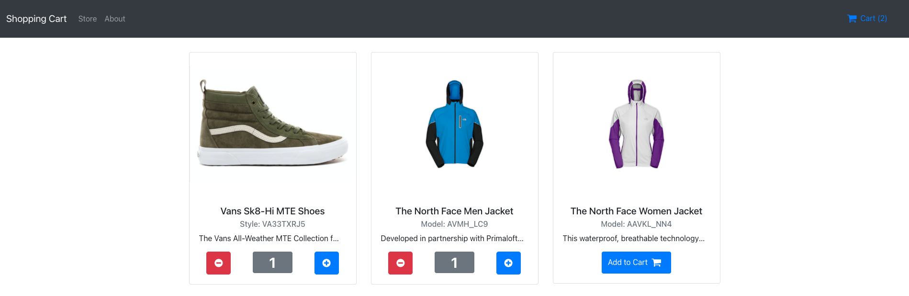

# Shopping Cart

In this project, I performed operations such as listing products, adding products to the cart and removing products from the cart, which are the features offered by an e-commerce website.

  

# Project setup

### `npm install`

# Project start

### `npm run start`
